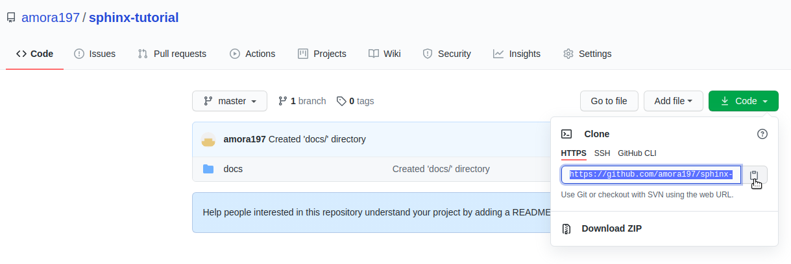
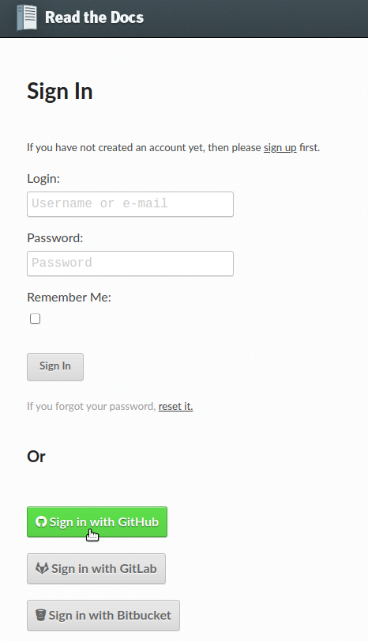
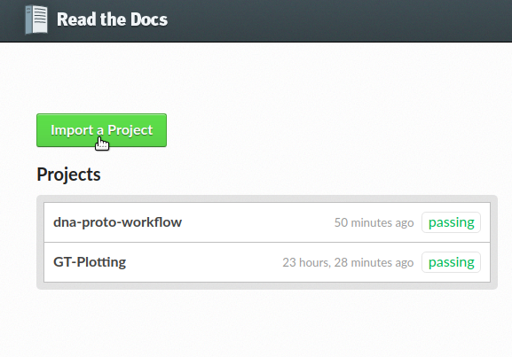
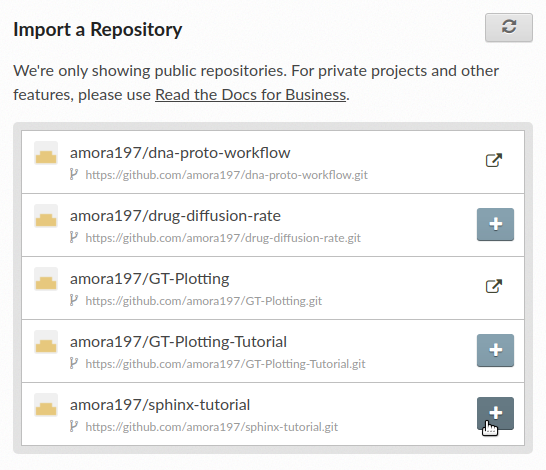
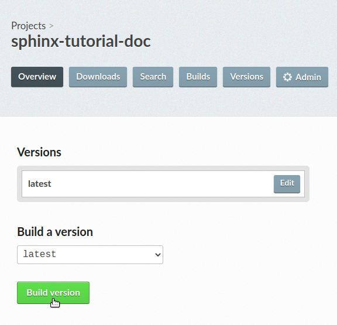

.. sphinx-tutorial documentation master file, created by
   sphinx-quickstart on Fri Dec  4 11:08:12 2020.
   You can adapt this file completely to your liking, but it should at least
   contain the root `toctree` directive.

Creating a ReadtheDocs Documentation
====================================

Background
^^^^^^^^^^

This tutorial describes a step-by-step tutorial to create a ReadtheDocs webpage and PDF file of an already created GitHub repository, using `sphinx <https://www.sphinx-doc.org/en/master/>`_, `LaTex <https://www.latex-project.org/>`_, `conda <https://docs.conda.io/en/latest/>`_, and `git <https://git-scm.com/>`_. The online step-by-step documentation can also be found `online in the ReadtheDocs webpage <https://sphinx-tutorial-anibal.readthedocs.io/en/latest/>`_ or by copy/pasting the following link: https://sphinx-tutorial-anibal.readthedocs.io/en/latest/.

.. note::
   
   This is run using Ubuntu 18.04 Bionic Beaver. For different Ubuntu distributions, download and install the appropriate software/packages.

   Code ran on Linux terminal is preceded by ``$``.

Installing conda and Setting Up bioconda Channels
^^^^^^^^^^^^^^^^^^^^^^^^^^^^^^^^^^^^^^^^^^^^^^^^^

It is recommended to install miniconda3 and create a conda environment to install all necessary packages and dependencies without affecting the system. Miniconda is a free minimal installer for conda. It is a small, bootstrap version of Anaconda that includes only conda, Python, the packages they depend on, and a small number of other useful packages, including pip, zlib and a few others. Use the conda install command to install 720+ additional conda packages from the Anaconda repository.

Open a new terminal **(Ctrl + Alt + T)** and make sure that the system is up-to-date,

:: 

   $ sudo apt-get update

Download the latest package from the '`Miniconda Webpage <https://docs.conda.io/en/latest/miniconda.html>`_ and install it with,

::

   $ curl -O https://repo.anaconda.com/miniconda/Miniconda3-latest-Linux-x86_64.sh
   $ sh Miniconda3-latest-Linux-x86_64.sh

It may be possible that Python 2.7 was installed with miniconda3. In order to use a newer version of Python, install the preferred Python version and update conda to resolve any dependency failures,

::

   $ conda install -c anaconda python=3.7

Setup the appropriate bioconda channels. Make sure to run the following commands exactly in this order,

::

   $ conda config --add channels defaults
   $ conda config --add channels bioconda
   $ conda config --add channels conda-forge

Bioconda is now enabled, so you can install any packages and versions available on the bioconda channel.

Creating a conda environment
^^^^^^^^^^^^^^^^^^^^^^^^^^^^

Create a new conda environment with:

::

   $ conda create --name <environment-name>

Substitute ``<environment-name>`` with the preferred name you want. As an example, 

::

   $ conda create --name sphinx-tutorial

Once the newly created environment has been installed, activate it to make the neccesary installations. Activate the conda environment with,

::

   $ conda activate sphinx-tutorial

If more than one conda environment exists, the previously created conda environments can be listed in the terminal by running, 

::

   $ conda env list

Installing sphinx, LaTex, and git
^^^^^^^^^^^^^^^^^^^^^^^^^^^^^^^^^

Install git, sphinx and LaTex using by conda with,

::

   $ conda install git
   $ conda install sphinx
   $ conda install sphinx_rtd_theme
 
LaTex cannot be installed with conda, so the installation is done with,

::
   $ sudo apt-get install texlive-latex-extra

Cloning the GitHub Repository to Local Machine
^^^^^^^^^^^^^^^^^^^^^^^^^^^^^^^^^^^^^^^^^^^^^^

The sphinx and LaTex documentation will be created in the local machine. For this, the GitHub repository needs to be cloned to the local machine, edited locally, and then pushed back to GitHub. In order to clone the repository, navigate to the corresponding webpage in GitHub, click on **Code**, and copy the HTTPS link by highlighting the provided link or clicking the **Clipboard** sign, as shown bellow.

   Link used to clone locally the repository. (click to expand)

Clone the repo in the Linux terminal into a location of choice. It is recommended to have a specific directory with GitHub repositories for being organized. Substitute ``<user-name>`` and ``<repo-name>`` with the correct user and repository names, accordingly, using,

:: 

   $ git clone https://github.com/<user-name>/<repo-name>.git

Navigate to your cloned repository in the local machine,

::

   $ cd /path/to/GitHub/cloned/repo

Running sphinx-quickstart
^^^^^^^^^^^^^^^^^^^^^^^^^

A ``docs/`` directory is needed to contain all the files sphinx will create. Create a ``docs/`` directory with,

::

   $ mkdir docs
   $ cd docs/

Run sphinx to start building the documentation,

::

   $ sphinx-quickstart

Prompts will pop up, asking about the project information. Fill them out accordingly. Here is an example,

::
 
   > Project name: sphinx-tutorial
   > Author name(s): Anibal Morales
   > Project release []: 1.0
   > Project language [en]:  **(press Enter/Return; default to English '[en]')**

Once the project information has been collected, the following output should be seen

::

   Creating file /home/anibal/miniconda3/envs/rtd-tutorial/doctut/docs/source/conf.py.
   Creating file /home/anibal/miniconda3/envs/rtd-tutorialsphinx-quickstart/doctut/docs/source/index.rst.
   Creating file /home/anibal/miniconda3/envs/rtd-tutorial/doctut/docs/Makefile.
   Creating file /home/anibal/miniconda3/envs/rtd-tutorial/doctut/docs/make.bat.
 
   Finished: An initial directory structure has been created.
 
   You should now populate your master file /home/username/miniconda3/envs/CondaEnv/repo-name/docs/source/index.rst and create other documentation source files. Use the Makefile to build the docs, like so:
   **make builder**
   where "builder" is one of the supported builders, e.g. html, latex or linkcheck.

Inside the ``docs/`` directory, there should be the ``build/`` and ``source/`` directories, along the ``make.bat`` and ``Makefile`` files,

::

   $ ls
   build  make.bat  Makefile  source

It is recommended to create inside the ``docs/``directory  an ``images/`` directoy to store all the image files that need to be included in the documentation.

:: 

   $ mkdir images
   $ ls
   build  images  make.bat  Makefile  source

Editing the index.rst File
^^^^^^^^^^^^^^^^^^^^^^^^^^

sphinx uses `reStructuredText (or reST) <https://docutils.sourceforge.io/rst.html>`_ as the default plaintext markup language. The ``index.rst`` file will contain all of the project documentation in reST format. sphinx provides a `reST Primer <https://www.sphinx-doc.org/en/master/usage/restructuredtext/basics.html>`_ to help making the documentation. In order to begin typing the documentation, navigate to the ``source/`` directory and edit the ``index.rst`` file as needed with whichever text editor of choice,

::

   $ cd source
   $ gedit index.rst

Editing the conf.py File
^^^^^^^^^^^^^^^^^^^^^^^^

The ``conf.py`` file contains the metadata about the project. It also contains the themes, styles, and guidelines that sphinx needs to make the HTML and PDF files. In order to edit the ``conf.py`` file, navigate to the ``source/`` directory, which also contains the ``index.rst`` file. After the ``#--Project information--`` section, add the following to the file,

::

   # -- General configuration ---------------------------------------------------

   # install the needed theme with:
   import sphinx_rtd_theme

   # Add any Sphinx extension module names here, as strings. They can be
   # extensions coming with Sphinx (named 'sphinx.ext.*') or your custom
   # ones.
   extensions = ['sphinx.ext.autodoc',
      'sphinx.ext.doctest',
      'sphinx.ext.intersphinx',
      'sphinx.ext.todo',
      'sphinx.ext.coverage',
      'sphinx.ext.mathjax',
      'sphinx.ext.ifconfig',
      'sphinx.ext.viewcode',
      'sphinx.ext.githubpages'
   ]

   # Add any paths that contain templates here, relative to this directory.
   templates_path = ['_templates']
   source_suffix = '.rst'

   # List of patterns, relative to source directory, that match files and
   # directories to ignore when looking for source files.
   # This pattern also affects html_static_path and html_extra_path.
   exclude_patterns = ['_build', 'Thumbs.db', '.DS_Store']

   # -- Options for HTML output -------------------------------------------------

   # The theme to use for HTML and HTML Help pages.  See the documentation for
   # a list of builtin themes.
   pygments_style = 'sphinx'
   master_doc = 'index'

   html_theme = "sphinx_rtd_theme"
   html_add_permalinks = ""

   html_theme_options = {
       'sticky_navigation': True,
       'collapse_navigation': False,
   }

   # -- Options for LaTeX output ---------------------------------------------

   latex_engine = 'pdflatex'
   latex_theme = 'howto'
   latex_toplevel_sectioning = 'section'

   # Configuration of Title Page
   latex_maketitle = r'''
           \pagenumbering{Roman} %%% to avoid page 1 conflict with actual page 
           \begin{titlepage}
               \vspace*{10mm} %%% * is used to give space from top, Title
               \flushright\textbf{\Huge {Creating a ReadtheDocs Documentation v1.0}}
               \vspace{0mm} %%% Sub-Title
               \textbf{\Large {A Step-by-Step Guide}}
               \vspace{50mm} % Author name
               \textbf{\Large {Anibal E. Morales}}
               \vspace{10mm} % Organization Name
               \textbf{\Large {Plant Breeding and Genetics Laboratory}}
               \vspace{0mm} % Division/Department
               \textbf{\Large {FAO/IAEA Joint Division}}
               \vspace{0mm} % City, Country
               \textbf{\Large {Seibersdorf, Austria}}
	       \vspace{10mm} % Creation Date
               \normalsize Created: October, 2020
               \vspace*{0mm} % Last updated Date
               \normalsize  Last updated: 4 December 2020
               %% \vfill adds at the bottom a note or caution
               \vfill
               \small\flushleft {{\textbf {Please note:}} \textit {This is an important note at the bottom of the title page.}}
           \end{titlepage}
           \pagenumbering{arabic}
           \newcommand{\sectionbreak}{\clearpage}
   '''
   latex_elements = {
      'releasename': 'Version 1.2',
      'maketitle': latex_maketitle,
   }

Under the ``#--Options for LaTex output--``, edit the ``\begin{titlepage}`` section. Comments with ``%`` are added, specifying the information that should be typed.

Making the HTML and PDF Files
^^^^^^^^^^^^^^^^^^^^^^^^^^^^^

Once the ``conf.py`` and ``index.rst`` files have been edited, it is time to make the HTML and PDF files. First, navigate to the ``docs/`` directory where the ``build``, ``source``, ``make.bat``, and ``Makefile`` are. 

::

   $ cd ..

Make the ``index.html`` and ``project-name.pdf`` files with the following commands,

::

   $ make html
   $ make latexpdf

If no errors pop up, the files have been built. Otherwise, fix the errors according to the error messages. and re-run the commands to make the files needed. The ``index.html`` file can be found inside the directory ``/docs/build/html/``, while the ``project-name.pdf`` file will be found inside the directory ``/docs/build/latex/``. Both files can be reviewed by opening them and checking the outputs created, using the ``xdg-open`` commands,

::

   $ xdg-open build/html/index.html 
   $ xdg-open build/latex/project-name.pdf

.. note::
   
   ``project-name.pdf`` will have the given name of the project been built. Here ``project-name`` represents a general name to specify where the file will be located after running ``make latexpdf``.

Edit and make the ``index.html`` and ``project-name.pdf`` files as many times as needed until the wanted results are found.

Pushing the Project to GitHub
^^^^^^^^^^^^^^^^^^^^^^^^^^^^^

Once all the edits and the wanted documentation styles are done, push the changes to the GitHub repository,

::

   $ git add .
   $ git commit <message describing the changes done>
   $ git push

Now that the edits are uploaded in the GitHub repository, it will be time to connect the GitHub repository to the ReadtheDocs website.

Importing the Project into ReadtheDocs
^^^^^^^^^^^^^^^^^^^^^^^^^^^^^^^^^^^^^^

Navigate to the `ReadtheDocs Website <https://readthedocs.org/accounts/login/>`_ and sign in with the option **Sign in with GitHub**.

   ReadtheDocs login with GitHub option. (click to expand)

Click on **Import a Project**.

   Import a project button. (click to expand)

Choose the project with the arrow symbol next to the repository that will be imported.

   Choosing the project to import by clicking the arrow next to it. (click to expand)

Click **Next**, followed by clicking the **Build version** button.

   Button to build the imported project. (click to expand)

Once the build has finished, click on the **View Docs** button where your ReadtheDocs webpage should be uploaded.

If the webpage opened without any errors, then CONGRATULATIONS! Otherwise, do resolve those issues to have a documentation webpage up and running. Any additional edits that are done on the Github repository will be reflected on this created ReadtheDocs webpage.

Hopefully, this tutorial is useful and helpful to create right-away a documentation webpage for people to use. 
